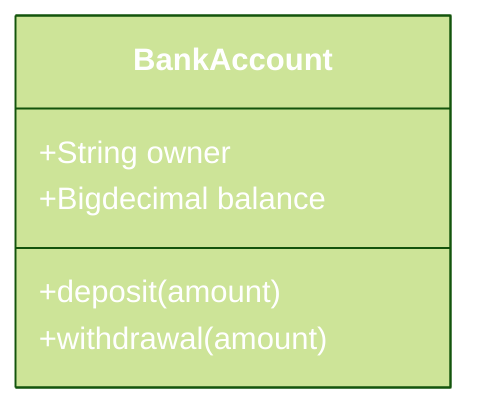
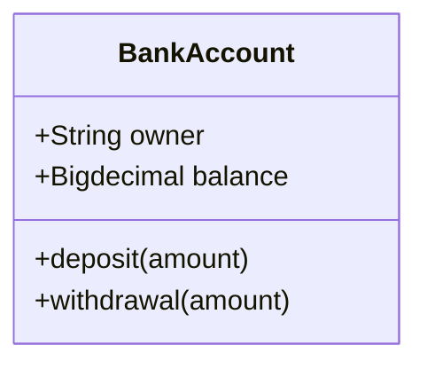

# Flow Record Analysis

The scope of the project is to analysis flow records and aggregate data for analysis based on port/tag.

## Design

The design is done as a batch process of reading files containing a flow log and processing to capture the aggregate data. This can be deployed as a jo

Due to time limitation only `FlowLog` version `2` is implemented.

## Development

### Prerequisites

1. `gradle` - The build tool for the project.
2. `junit5` and `junit5-params` - Unit testing third party libraries.

## Testing

### Unit Testing

1. `FlowLogParserTest` - Tests a single flow log
   * Test case with status `OK`.
   * Test case with 

## License

This code is under `illimno` license and cannot be reproduce without explicit permission.

### License of Third party Libraries

All third party used are opensource and no commerical libraries are used to implement the product.

1. `slf4j` - 
2. `logback` - 
3. `logback-stash` - 
4. `Junit` - 
5. `Junit-params` -
6. 

## Reference

### FlowLog - Requirement Analysis

1. [Flow log records](https://docs.aws.amazon.com/vpc/latest/userguide/flow-log-records.html)
2. [IANA Protocol Numbers](https://www.iana.org/assignments/protocol-numbers/protocol-numbers.xml)

### Tools and Library

1. [Gradle]()
2. [Parametrized JUnit 5](https://www.baeldung.com/parameterized-tests-junit-5)
